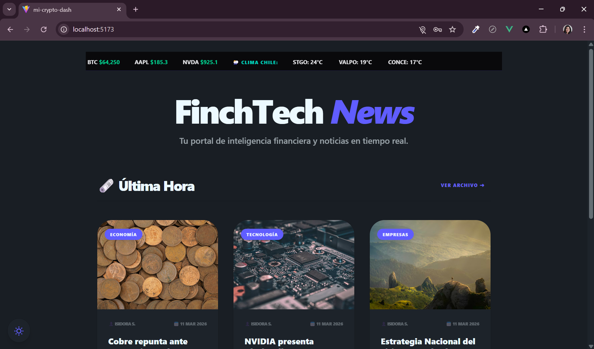

# 🚀 FinchTech Journal & Stock Dash

**FinchTech** es una plataforma integral de inteligencia financiera y meteorológica. El proyecto combina un simulador de inversiones en tiempo real con un blog de noticias dinámico y un sistema de monitoreo climático, cumpliendo con los requisitos avanzados del **Módulo 8**.

---

## 🌟 Características Principales (Módulo 8)

- 🔐 **Autenticación Robusta:** Sistema de Registro y Login integrado con **Firebase Auth**.
- 🗞️ **Portal de Noticias (Blog):** Feed dinámico de noticias financieras (Cobre, Litio, Tech) ordenadas cronológicamente desde **Firestore**.
- 💬 **Interacción Social:** Sistema de comentarios en tiempo real para cada noticia, permitiendo el debate técnico entre usuarios autenticados.
- 🌦️ **Módulo MeteoVite Pro:** Integración de un widget climático dinámico que utiliza la ubicación del usuario (Geolocalización) y la API de **Open-Meteo**.
- 🕒 **Historial Inteligente:** Sección de "Últimas noticias revisadas" que se actualiza dinámicamente mediante un Store de **Pinia**.
- 📈 **Simulador Bursátil:** Visualización de activos financieros en tiempo real con gráficas interactivas de **ApexCharts**.

---

## 🛠️ Stack Tecnológico

- **Frontend:** Vue 3 (Composition API) + Vite.
- **Estilos:** TailwindCSS + DaisyUI (Diseño responsivo y Modo Oscuro/Claro).
- **Estado:** Pinia (Manejo de estados globales y persistencia).
- **Backend:** Firebase (Firestore para datos y Auth para seguridad).
- **APIs:** Alpha Vantage (Finanzas) y Open-Meteo (Clima).
- **Seguridad:** Sanitización de HTML con **DOMPurify** y protección de rutas con Navigation Guards.

---

## 📁 Estructura del Proyecto

```text
mi-crypto-dash/
├─ scripts/         # Scripts de Seeding para Firestore (Noticias)
├─ src/
│  ├─ components/   # Componentes modulares (News, Dashboard, Weather)
│  ├─ composables/  # Lógica reutilizable (useWeather, useTheme)
│  ├─ services/     # Motores de API y conexión Firebase
│  ├─ stores/       # Estados de Pinia (Auth, News, History)
│  └─ views/        # Vistas principales y Detalle de Noticias
└─ .env             # Variables de entorno protegidas
```
## ⚡Visualización del Proyecto
Home Page |
Noticias generales | 
Noticia específica | 

## ⚡Instalación

### Clona el repositorio

```bash
git clone <URL_DEL_REPOSITORIO>
cd mi-crypto-dash
```

### Instala las dependencias

```bash
npm install
npm install -D tailwindcss@3 postcss autoprefixer
npm i -D daisyui@latest
```

### Inicia la aplicación en modo desarrollo

```bash
npm run dev
```

## 🔒 Seguridad

- Sanitización de contenido dinámico con DOMPurify para prevenir XSS.

- Buenas prácticas en el manejo de datos de Firebase y la API gratuita de Amazon.

## ⚙️ Configuración de Firebase

Crea un archivo .env con tus llaves de Firebase, Alpha Vantage y Unsplash.

```bash
# .env.example - EJEMPLO (subir a GitHub)
# Copie este archivo como .env y complete sus credenciales
VITE_FIREBASE_API_KEY=su_api_key_aqui
VITE_FIREBASE_AUTH_DOMAIN=su_proyecto.firebaseapp.com
VITE_FIREBASE_PROJECT_ID=su_proyecto_id
VITE_FIREBASE_STORAGE_BUCKET=su_proyecto.firebasestorage.app
VITE_FIREBASE_MESSAGING_SENDER_ID=su_sender_id
VITE_FIREBASE_APP_ID=su_app_id
VITE_FIREBASE_MEASUREMENT_ID=su_measurement_id

# API Configuration https://newsapi.org/register/ https://www.marketaux.com/register
VITE_NEWS_API_KEY=your_news_api_key
VITE_MARKETAUX_API_KEY= your_marketaux_key

#Alpha Vantage API - https://www.alphavantage.co/support/#api-key
VITE_ALPHA_VANTAGE_KEY=tu_alpha_vantage_key

#Base URL para producción (GitHub Pages)
VITE_BASE_URL=/nombre-de-tu-api/

# API Unplash para base de imagenes
VITE_UNSPLASH_KEY=tu_api_key_de_unsplash_aqui

```

Luego reinicia el servidor de desarrollo.

## 📈 Uso

- Explora gráficos de acciones y criptomonedas en tiempo real.

- Filtra por rango de fechas y tipo de activo.

- Consulta indicadores clave de inversión de manera intuitiva.

## 📱 Futuras Mejoras de UX y Responsividad

Optimización móvil:

- Asegurarte de que los gráficos se vean correctamente en pantallas pequeñas.

- Menús desplegables tipo “hamburger” para navegación.

- Ajustes en tipografía y botones para tocar con facilidad.

Botones y conexiones al perfil:

- Botón para acceder al perfil del usuario con configuración y favoritos.

- Historial de gráficos o acciones favoritas por usuario.

- Posibilidad de personalizar alertas o notificaciones.

## 📊 Futuras Mejoras de Datos y Visualización

Indicadores avanzados:

- Promedios móviles, RSI, MACD u otros indicadores técnicos.

- Mostrar tendencias y cambios porcentuales de manera clara.

Filtrado avanzado:

- Filtrar por rangos de fecha, tipo de activo, volumen de transacción, etc.

Notificaciones o alertas:

- Alertas cuando un activo suba o baje cierto porcentaje.

- Push notifications o correo vía Firebase Cloud Functions.

🔒 Seguridad y Backend

Autenticación avanzada:

- Login con Google, GitHub o correo y contraseña (Firebase Auth).

- Protección de rutas para usuarios autenticados.

Protección de datos sensibles:

- Guardar tokens de la API y credenciales solo en el backend o Firebase Functions.

- Validar y sanitizar toda entrada del usuario.

⚡ Experiencia de Usuario Adicional

Favoritos y watchlist:

- Permitir que el usuario marque sus acciones o criptos favoritas y las vea al abrir la app.

Exportar datos:

- Exportar gráficos o tablas a CSV o PDF.

- Facilita análisis fuera de la app.

- Animaciones y microinteracciones:

- Hover sobre gráficos para ver valores exactos.

- Transiciones suaves al cambiar de vista.

## 👩‍💻 Sobre la Autora: Isabel Guajardo
Desarrolladora Front-End

🔗 LinkedIn: Isabel Guajardo
📺 YouTube: @IsabelGuajardo-f1e 

## 📄 Licencia

Este proyecto está bajo la licencia MIT.
